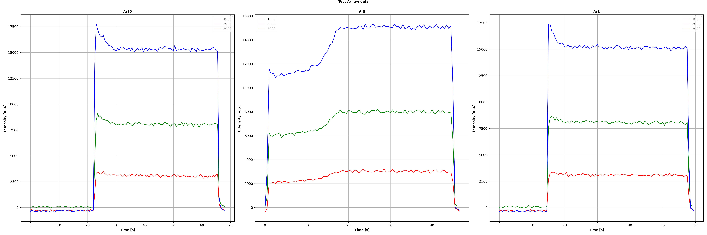

# AE_PlasEquipVarDyn: Autoencoder for Plasma Equipment Variable Dynamics

This repository contains an implementation of an autoencoder-based model for analyzing and predicting plasma equipment variables using deep learning. The model incorporates variational, residual, and logarithmic autoencoders for dynamic prediction tasks in plasma processing.

## Overview

The model leverages neural networks to encode and decode plasma-related data, using a dynamic attention-based architecture. It employs different types of autoencoders (standard, residual, logarithmic, and variational) to model the behavior of process variables over time.

## Data

### Train Data

### Test Data



### Key Features:
- **Autoencoder Models**: Uses various autoencoder types such as standard autoencoder, residual autoencoder, and variational autoencoders.

- **Plasma Equipment Variable Dynamics**: Incorporates domain-specific processing and variable dynamics for plasma equipment.
- **Customization**: Fully customizable parameters for training, with different activation functions, normalization techniques, and encoder models.
  
## Classes

### `AE_PlasEquipVarDyn`
This is the main class that defines the autoencoder architecture for plasma equipment variable dynamics.

- **Attributes**:
    - `params`: A dictionary containing model parameters.
    - `date`: Current date string (for saving models).
    - `encoder_model`: Pretrained encoder model.
    - `PlasVarEquipDynDict`: A dictionary holding the network layers and encoder models.

- **Methods**:
    - `_set_default_params()`: Initializes default parameters for the model.
    - `_load_encoder_model()`: Loads the encoder model from the specified directory.
    - `_setup_save_path()`: Sets up the directory for saving model results.
    - `forward(X, L)`: Performs forward propagation with the input data `X` and process variables `L`.
    - `encode(X)`: Encodes the input `X` using the pretrained encoder model.
    - `plasvarequipdyn(Z, V)`: Applies dynamic transformations based on the model architecture.
    - `init_params()`: Initializes the model with the provided parameters.
    - `loss(z_hat, z)`: Computes the loss using Mean Squared Error (MSE), Cosine Loss, and L1 Regularization.
    - `mse_loss(z_hat, z)`: Computes the MSE loss.
    - `cos_loss(z_hat, z)`: Computes the cosine similarity loss.
    - `l1_loss()`: Computes the L1 regularization loss.

### `ResAE_PlasEquipVarDyn`, `LogAE_PlasEquipVarDyn`, `LogResAE_PlasEquipVarDyn`, etc.
These are specialized versions of the `AE_PlasEquipVarDyn` class, each with a different encoder type:
- `ResAutoencoder`
- `LogAutoencoder`
- `LogResAutoencoder`
- `VariationalAutoencoder`
- Variants with `Res`, `Log`, and `Variational` suffixes for specific architectures.

## Requirements

The following Python libraries are required to run the code:

- `torch`
- `glob`
- `re`
- `os`
- `time`
- `pickle`

### Install Dependencies
To install the necessary dependencies, you can use `pip`:

```bash
pip install torch
pip install glob
pip install re
